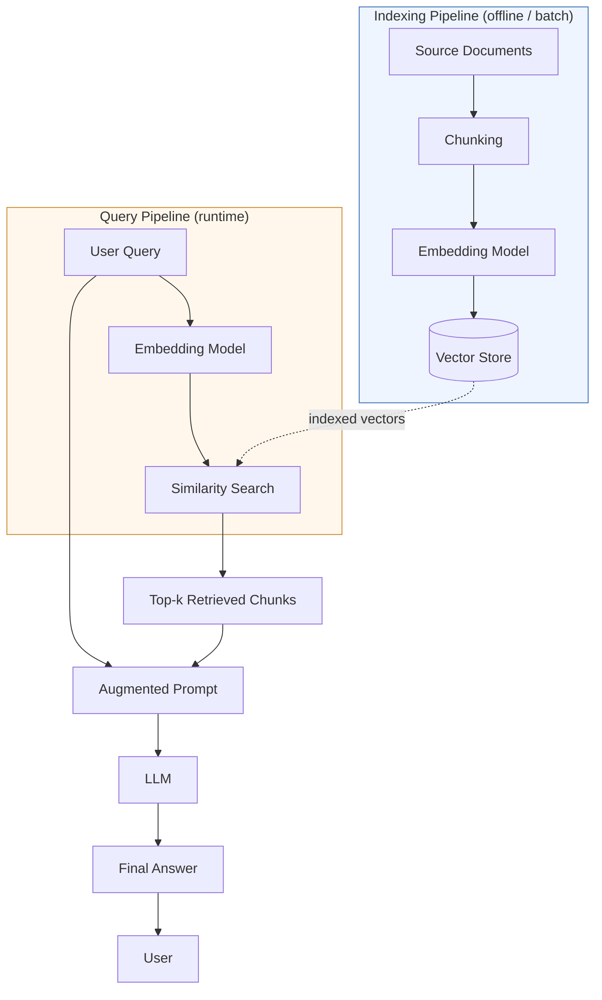

```mermaid
flowchart TD
    subgraph IDX["Indexing Pipeline (offline / batch)"]
        direction TB
        A[Source Documents] --> B[Chunking]
        B --> C[Embedding Model]
        C --> D[(Vector Store)]
    end

    subgraph QRY["Query Pipeline (runtime)"]
        direction TB
        E[User Query] --> F[Embedding Model]
        F --> G[Similarity Search]
    end

    D -.indexed vectors.-> G
    G --> H[Top-k Retrieved Chunks]
    E --> I[Augmented Prompt]
    H --> I
    I --> J[LLM]
    J --> K[Final Answer]
    K --> L[User]

    style IDX fill:#eef5ff,stroke:#3b6fb6
    style QRY fill:#fff7ec,stroke:#c98a2c
```
